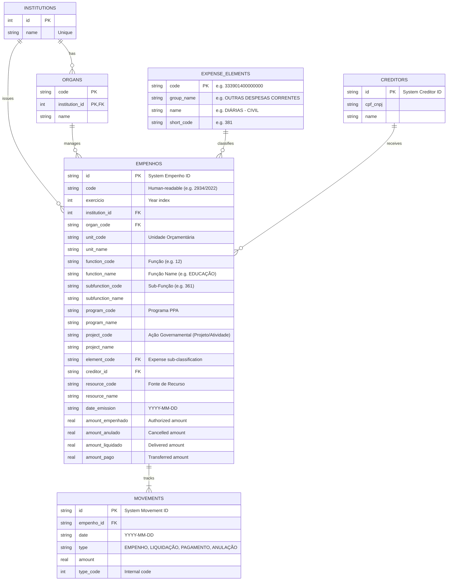

# Campina Grande Transparency Portal Scraper & Database System

This module provides a production-grade, fully automated scraping and relational database system to extract, structure, and continuously update all financial transaction information from the **Portal da Transparência de Campina Grande (PB)** (built on the DBSeller `e-cidade` public software stack).

The extracted data is parsed into a highly normalized **SQLite relational database** (`transparencia_cg.db`), making it immediately ready for advanced financial audits, custom interactive dashboards (Next.js/Vite), and training Machine Learning/AI models for fraud and anomaly detection.

---

## 1. Database Architecture & Schema Design

The database has been designed to strictly represent the hierarchical, transactional, and relational nature of public municipal spending in Brazil. Rather than dumping raw text into a single wide table, the schema is normalized into 6 main entities to enable clean querying, enforce constraints, and minimize storage footprints.

### Entity-Relationship Diagram (ERD)



### Table Breakdown

#### 1. `institutions`
Represents the municipal administrative entities.
*   `id` (INTEGER, PK): Unique identification of the public body (e.g., `2` for Prefeitura Municipal, `7` for AMDE).
*   `name` (TEXT, NOT NULL, UNIQUE): Formal name (e.g., `"PREFEITURA MUNICIPAL DE CAMPINA GRANDE"`).

#### 2. `organs`
Subsections or departments within an institution.
*   `code` (TEXT, PK): Code of the organ (e.g., `"4"` for AMDE, `"2"` for PMCG).
*   `institution_id` (INTEGER, PK, FK): Reference to the parent institution.
*   `name` (TEXT, NOT NULL): Name of the organ.

#### 3. `creditors`
Companies, contractors, or individual public servants receiving public funds.
*   `id` (TEXT, PK): Unique creditor identification code in the city's software.
*   `cpf_cnpj` (TEXT): Masked or raw fiscal document number.
*   `name` (TEXT, NOT NULL): Name of the individual or legal entity.

#### 4. `expense_elements`
Standardized budget classifications representing what exactly the money was spent on.
*   `code` (TEXT, PK): Full classification number (e.g., `333901400000000`).
*   `group_name` (TEXT): Broad classification group (e.g., `"INVESTIMENTOS"`, `"OUTRAS DESPESAS CORRENTES"`).
*   `name` (TEXT, NOT NULL): Specific element description (e.g., `"EQUIPAMENTOS E MATERIAL PERMAN"`, `"DIÁRIAS - CIVIL"`).
*   `short_code` (TEXT): Internal code identifier (e.g., `381`).

#### 5. `empenhos`
A formal contract commitment or purchase order. Every expense transaction is grouped under an *Empenho*.
*   `id` (TEXT, PK): Internal system transaction ID (e.g. `21928`).
*   `code` (TEXT, NOT NULL): Human-readable budget code (e.g. `"2934 / 2022"`).
*   `exercicio` (INTEGER, NOT NULL): Fiscal year of execution (2020, 2021, 2022).
*   `institution_id` (INTEGER, NOT NULL, FK): Institution initiating the expense.
*   `organ_code` (TEXT, NOT NULL, FK): Organ initiating the expense.
*   `unit_code` & `unit_name` (TEXT): Budget unit (Unidade Orçamentária, e.g., Secretaria de Educação).
*   `function_code` & `function_name` (TEXT): Administrative function classification (e.g., `12` - `"EDUCAÇÃO"`).
*   `subfunction_code` & `subfunction_name` (TEXT): Sub-function classification (e.g., `361` - `"ENSINO FUNDAMENTAL"`).
*   `program_code` & `program_name` (TEXT): Long-term development program (e.g., `"Gestão do sistema municipal de ensino"`).
*   `project_code` & `project_name` (TEXT): Government project or administrative activity.
*   `element_code` (TEXT, NOT NULL, FK): Specific expense element.
*   `creditor_id` (TEXT, NOT NULL, FK): Creditor entity.
*   `resource_code` & `resource_name` (TEXT): Specific tax/funding source (e.g., `"RECURSOS NÃO VINCULADOS DE IMPOSTOS - MDE"`).
*   `date_emission` (TEXT, NOT NULL): Date of issuing (YYYY-MM-DD).
*   `amount_empenhado` (REAL): Committed funds.
*   `amount_anulado` (REAL): Cancelled/voided funds.
*   `amount_liquidado` (REAL): Value of services/goods delivered.
*   `amount_pago` (REAL): Value actually paid/transferred to the creditor's bank account.

#### 6. `movements`
The direct transaction ledger showing exactly when money moved.
*   `id` (TEXT, PK): Transaction log ID.
*   `empenho_id` (TEXT, NOT NULL, FK): Reference to parent Empenho.
*   `date` (TEXT, NOT NULL): Date of transaction.
*   `type` (TEXT, NOT NULL): Movement type (`EMPENHO`, `LIQUIDAÇÃO`, `PAGAMENTO`, `ANULAÇÃO`).
*   `amount` (REAL, NOT NULL): Monetary value.
*   `type_code` (INTEGER): Internal operation code (e.g., 1=Empenho, 3=Liquidação, 5=Pagamento).

### 1.2 Relational Design & Database Organization Details

The database is built on relational best practices to ensure high performance, strict referential integrity, and flexibility for future analytical expansions.

#### A. Normalization & Constraints (3NF)
*   **Third Normal Form (3NF)**: Redundancy is minimized. Static descriptors like creditor names, organ titles, and expense element categories are split into standalone entity tables (`creditors`, `organs`, `expense_elements`). The transaction tables (`empenhos`, `movements`) store only the foreign key references, preventing data anomalies and optimizing size.
*   **Referential Integrity**: Tables enforce mandatory constraints (`NOT NULL` on parent keys) and cascading behaviors (e.g., `ON DELETE CASCADE` on `movements` so deleting a voided `empenho` automatically removes its transaction ledger logs).
*   **Composite Primary Key**: The `organs` table uses a composite primary key `(code, institution_id)` because different administrative entities can use overlapping department numbers.

#### B. Indexing Strategy for High-Performance Queries
To ensure sub-millisecond query performance on dashboards and rapid audit scans, the following SQL indexes are created on foreign keys and commonly filtered columns:
```sql
CREATE INDEX idx_empenhos_creditor ON empenhos(creditor_id);
CREATE INDEX idx_empenhos_element ON empenhos(element_code);
CREATE INDEX idx_empenhos_date ON empenhos(date_emission);
CREATE INDEX idx_movements_empenho ON movements(empenho_id);
CREATE INDEX idx_movements_date ON movements(date);
```

#### C. Unified Relational Blueprint (Future-Proof Extensions)
The relational schema can easily expand to host the other datasets cataloged in `DATA_AVAILABILITY.md`. The DDL schema below details how the additional tables are structurally organized and connected to our core database:

```sql
-- 1. Revenues Table (Relates dynamically via exercise year)
CREATE TABLE IF NOT EXISTS receitas (
    id INTEGER PRIMARY KEY AUTOINCREMENT,
    exercicio INTEGER NOT NULL,
    classificacao TEXT NOT NULL,
    descricao TEXT NOT NULL,
    valor_previsto REAL DEFAULT 0,
    valor_arrecadado REAL DEFAULT 0,
    diferenca REAL DEFAULT 0,
    date_ref TEXT NOT NULL -- YYYY-MM
);

-- 2. Civil Servant Payroll Records (Standalone relational table)
CREATE TABLE IF NOT EXISTS payroll_records (
    id INTEGER PRIMARY KEY AUTOINCREMENT,
    matricula TEXT NOT NULL UNIQUE,
    nome_servidor TEXT NOT NULL,
    cargo TEXT NOT NULL,
    tipo_vinculo TEXT NOT NULL,
    lotacao TEXT NOT NULL,
    data_admissao TEXT, -- YYYY-MM-DD
    salario_base REAL DEFAULT 0,
    vantagens REAL DEFAULT 0,
    descontos REAL DEFAULT 0,
    salario_liquido REAL DEFAULT 0,
    mes INTEGER NOT NULL,
    ano INTEGER NOT NULL
);

-- 3. Public Bidding processes
CREATE TABLE IF NOT EXISTS licitacoes (
    processo TEXT PRIMARY KEY,
    modalidade TEXT NOT NULL,
    objeto TEXT NOT NULL,
    data_abertura TEXT NOT NULL, -- YYYY-MM-DD
    situacao TEXT NOT NULL,
    valor_estimado REAL DEFAULT 0,
    valor_homologado REAL DEFAULT 0
);

-- 4. Contracts signed with suppliers (Bridges licitacoes, creditors and expenses)
CREATE TABLE IF NOT EXISTS contratos (
    numero_contrato TEXT PRIMARY KEY,
    licitacao_processo TEXT,
    contratado_creditor_id TEXT NOT NULL,
    vigencia_inicio TEXT NOT NULL, -- YYYY-MM-DD
    vigencia_fim TEXT NOT NULL,    -- YYYY-MM-DD
    valor_contrato REAL NOT NULL,
    FOREIGN KEY (licitacao_processo) REFERENCES licitacoes(processo) ON DELETE SET NULL,
    FOREIGN KEY (contratado_creditor_id) REFERENCES creditors(id)
);

-- 5. Travel Allowances (References both personnel payroll and budget empenhos)
CREATE TABLE IF NOT EXISTS diarias (
    id INTEGER PRIMARY KEY AUTOINCREMENT,
    beneficiario_matricula TEXT NOT NULL,
    nome_beneficiario TEXT NOT NULL,
    cargo_servidor TEXT NOT NULL,
    destino TEXT NOT NULL,
    periodo_viagem TEXT NOT NULL,
    justificativa TEXT NOT NULL,
    valor_pago REAL NOT NULL,
    empenho_id TEXT, -- Relates directly to the budget commit order
    FOREIGN KEY (beneficiario_matricula) REFERENCES payroll_records(matricula),
    FOREIGN KEY (empenho_id) REFERENCES empenhos(id) ON DELETE SET NULL
);

-- 6. Infrastructure Works (Maps construction execution progress to Contracts)
CREATE TABLE IF NOT EXISTS obras (
    id INTEGER PRIMARY KEY AUTOINCREMENT,
    nome_obra TEXT NOT NULL,
    localizacao TEXT NOT NULL,
    empresa_executora TEXT NOT NULL,
    percentual_exec REAL DEFAULT 0,
    valor_contratado REAL NOT NULL,
    valor_pago_acum REAL DEFAULT 0,
    contrato_numero TEXT,
    FOREIGN KEY (contrato_numero) REFERENCES contratos(numero_contrato) ON DELETE SET NULL
);
```

#### D. Inter-Module Data Crossings (Auditing Mapping)
These connections enable powerful multi-dimensional crossings directly in SQL:
1.  **Travel Auditing**: Selecting from `diarias` joined with `payroll_records` on `beneficiario_matricula = matricula` and joined with `empenhos` on `empenho_id = id` allows cross-referencing salary caps against individual travel allocations.
2.  **Procurement Overspending**: Joining `contratos` and `licitacoes` on `licitacao_processo = processo` highlights contracts that exceed homologated bidding limits.
3.  **Physical Infrastructure Progress**: Selecting `obras` joined with `contratos` on `contrato_numero = numero_contrato` allows calculating whether actual financial payments outpace the verified physical progress of public work projects.

---

## 2. API Reverse Engineering & Scraping Mechanics

The website uses a jQuery grid system (`jqGrid`) that consumes a PHP backend. In this system, **state is stored in the PHP server session (`$_SESSION`)**. This means a scraper cannot simply make arbitrary requests to sub-endpoints like `getEmpenhos`; doing so will return empty data because the server doesn't know what you are querying.

To solve this, the scraper mimics the exact multi-level drill-down state transitions executed by the frontend:

1.  **Session Setup**:
    We first call `GET /api/despesas` to obtain a session cookie (`PHPSESSID`).
2.  **Filter Injection**:
    We make a POST to `/api/despesas/loadLink/1` containing the year (`iExercicio`), date ranges (`dtInicio`, `dtFim`), and an initial list representation (`aHistorico`). This initializes the session variables on the server.
3.  **API Drills**:
    We then query `POST /api/despesas/getInstit` to fetch all institutions.
4.  **Deep Drilldowns (Recursion)**:
    To go deeper, we simulate selecting a row by POSTing again to `/api/despesas/loadLink/1` but with the parameters updated:
    *   Incrementing level (`iNivel = 4`, `5`, `6`, `7`, `8`).
    *   Injecting the parent IDs (`iInstituicao`, `iOrgao`, `iElemento`, `iCredor`, `iEmpenho`).
    *   Appending the clicked row's details to the `aHistorico` array.
5.  **Data Extraction**:
    Once the session state is updated, we call the corresponding JSON backend endpoints:
    *   `getOrgao`: Fetches organs.
    *   `getElementos`: Fetches expense elements.
    *   `getCredores`: Fetches creditors list.
    *   `getEmpenhos`: Fetches individual procurement contracts.
    *   `getMovimentacoesEmpenhos`: Fetches the final bank/invoice transaction movements.
    *   `getDotacaoEmpenho`: Fetches the budget allocation structure (resolving function, program, activity, resource, and unit).

---

## 3. How to Run the Scripts

### Prerequisites
Make sure Python 3.x is installed with the `requests` library:
```bash
pip install requests
```

### Initializing the Database Schema
The database file `transparencia_cg.db` is automatically created and initialized with all structural tables when you run either `db.py` or `scraper.py` for the first time. To manually initialize:
```bash
python db.py
```

### Running a Sync
You can run a sync/update by executing:
```bash
python scraper.py
```

By default, the scraper script is configured with **dry-run limits** (scraping 1 institution, 1 organ, 2 elements, 2 creditors, and 2 contracts) so it executes in a few seconds to verify the connection and show the database population process.

### Scaping All Historical Data
To fetch **all historical data** for an entire year (e.g. 2022, 2021, or 2020), open `/scrapping/scraper.py` and modify the bottom `__main__` execution block:

```python
# To scrape all data for 2022 without any boundaries:
scraper = CampinaGrandeScraper(year=2022, start_date="01/01", end_date="31/12")
scraper.scrape_all(
    db_conn,
    limit_institutions=None,
    limit_organs=None,
    limit_elements=None,
    limit_credores=None,
    limit_empenhos=None
)
```

---

## 4. Blueprints for AI-Powered Verification & Audit System

With the transaction data safely organized in this structured SQL database, you can build powerful verification layers. Here are three architectural blueprints:

### A. Anomaly Detection on Transaction Values (ML Layer)
*   **Goal**: Flag payments that are unusually high compared to other transactions under the same budget category.
*   **How**:
    1. Extract all movements of type `PAGAMENTO` grouped by `element_code` (e.g., DIÁRIAS - CIVIL).
    2. Train an unsupervised **Isolation Forest** or **One-Class SVM** model on the transaction `amount`.
    3. Transactions with an anomaly score below a threshold (e.g., a servant receiving R$ 10,000 in diárias in a single day when the average is R$ 330) are automatically flagged for manual review.

### B. Natural Language Auditor on Creditor/Contract Matches (AI/LLM Layer)
*   **Goal**: Cross-reference creditor names/activity descriptions against budget classifications to detect conflicts of interest or misallocations.
*   **How**:
    1. Select an empenho and its associated creditor (e.g. a company named "CONSTRUTORA XYZ").
    2. Join with the `expense_elements` table to see what the money was allocated for (e.g., "DIÁRIAS - CIVIL" or "Material de Consumo").
    3. Pass this pair to a Large Language Model (e.g., Gemini) with a prompt:
       > *"Analyze this transaction: Company Name: 'CONSTRUTORA XYZ'. Budget allocation category: 'DIÁRIAS - CIVIL' (Civil Servant Daily Travel Allowances). Does this category match the typical operations of this company type? Flag as RED if there is a severe mismatch, or GREEN if it looks correct."*
    4. Since a construction firm should not be receiving travel allowances, the LLM will flag this immediately as a red flag for auditing.

### C. Budget Forecasting & Leakage Analysis (Time-Series Layer)
*   **Goal**: Monitor the velocity of municipal spending and predict budget exhaustion or anomalies.
*   **How**:
    1. Build time-series models (e.g., Prophet, ARIMA) on the sum of `amount_liquidado` and `amount_pago` grouped by week or month.
    2. Spot spikes in spending in specific months (e.g., unusual increases in expenses immediately preceding local municipal elections).
    3. Highlight organs that show irregular cash-flow consumption velocities.
