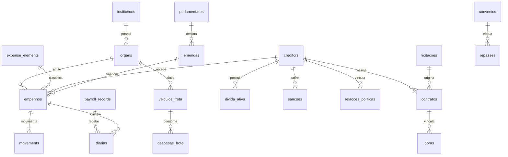

# Campina Grande Transparency Portal Scraper & Database System
## Cidade Aberta Project

This module provides a production-grade, fully automated scraping, relational database, and AI-powered analytical auditing system to extract, structure, analyze, and continuously monitor all financial transaction information from the **Portal da Transparência de Campina Grande (PB)** (built on the DBSeller `e-cidade` public software stack).

The extracted data is parsed into a highly normalized, 20-table **SQLite relational database** (`transparencia_cg.db`), making it immediately ready for advanced financial audits, interactive dashboards (Next.js/Vite), and Machine Learning/AI models for anomaly detection and forensic social control.

---

## 1. Relational Database Architecture (3NF)

The database schema is designed to represent every structural dimension of municipal transparency—spanning revenues, bidding processes, contracts, public works, payrolls, daily travel allowances, publicity campaigns, parliamentary amendments, active debt listings, vendor sanctions, and TSE political campaign donations.

### Entity-Relationship Diagram (ERD)



### Expanded Database Tables (All 20 Tables)

1.  **`institutions`**: Municipal administrative divisions (Prefeitura, Câmara, IPSEM).
2.  **`organs`**: Internal departments (Secretaria de Saúde, Educação, etc.).
3.  **`creditors`**: Vendors, contractors, or civil servants receiving funds.
4.  **`expense_elements`**: Budget classifications (e.g. Diárias, Consumo, Obras).
5.  **`empenhos`**: Purchase commitment orders containing financial transactions.
6.  **`movements`**: Transaction ledgers (Empenho, Liquidação, Pagamento, Anulação).
7.  **`receitas`**: Municipal revenue streams (IPTU, ISS, FPM, etc.).
8.  **`licitacoes`**: Public bidding processes (Pregão, Concorrência, Dispensa, Inexigibilidade).
9.  **`contratos`**: Formal contracts signed with suppliers, referencing bidding.
10. **`obras`**: Infrastructure works containing progress percentages and contract references.
11. **`payroll_records`**: Servants' payroll entries (salaries, roles, employment types).
12. **`diarias`**: Daily travel allowances and justifications linked to empenhos.
13. **`publicidade`**: Institutional advertising logs containing agencies and vehicles.
14. **`emendas`**: Parliamentary budget allocations linking politicians to empenhos.
15. **`divida_ativa`**: Registry of municipal tax debtors.
16. **`sancoes`**: Suspended or blacklisted suppliers (CEIS/CNEP).
17. **`relacoes_politicas`**: TSE campaign donations and corporate partner mappings.
18. **`convenios`**: NGO partnerships, fomento terms, and allocations.
19. **`veiculos_frota`**: Municipal vehicle logs (Own, leased, outsourced).
20. **`despesas_frota`**: Maintenance and fuel logs linked to vehicles.

---

## 2. Advanced Relational Analytic Engine (`analyzer.py`)

The core analytical engine `CidadeAbertaAnalyzer` implements high-performance SQL query methods to address **18 distinct analytical audits** for citizen oversight:

1.  **Supplier Rankings**: Top suppliers by committed and paid totals, count of contracts, and departments served.
2.  **Procurement Patterns**: Direct procurement concentration and fractional purchase alerts (detecting artificial splits under the legal limit).
3.  **Monopolies by Category**: Identifies dominant firms across 14 categories (Cleaning, Merenda, Tech, Fuel, Vigilance, etc.).
4.  **Healthcare Auditing**: Focuses on drug procurement, medical service contracts, and price variations.
5.  **Education Auditing**: Tracks merenda, school transport, clothing, and books.
6.  **Advertising Tracking**: Spotlights publicity agencies, advertising vehicles, and electoral-year budget jumps.
7.  **Culture & São João Events**: Audits artist cachets, logistics, stage rentals, and inexigibilidade contracts.
8.  **Travel Diaries**: Flags servants with excessive travel allowances, repeated destinations, and reasons.
9.  **Outsourcing & Personnel**: Proportions of Effective, Commissioned, Temporary workers and major outsourcing firms.
10. **Fleet & Fuel Efficiency**: Average fuel costs, liters consumed, and maintenance expenses per vehicle.
11. **NGO & Third Sector**: Terms of Partnership/Fomento and NGO repasses.
12. **Parliamentary Amendments**: Follows the cash flow: Politician -> Amendment -> Project -> Supplier.
13. **Active Debt Crossings**: Flags companies gaining contracts while being municipal tax debtors.
14. **Supplier Sanctions**: Identifies suspended or blacklisted suppliers gaining active contracts.
15. **Political Connections (TSE)**: Crosses corporate partners with TSE campaign donors and contracts.
16. **Relational Network Graph**: Generates a unified JSON structure of Nodes and Edges connecting suppliers, partners, politicians, and departments.
17. **Top Highlights Dashboard**: Summarizes major highlights (debtors, direct purchases, top suppliers).
18. **Forensic Research Summary**: Blends active debt, electoral donations, and direct bids into one cohesive risk profile.

---

## 3. Interactive CLI Console (`run_analysis.py`)

The project features a beautiful, Portuguese-localized interactive console interface (`run_analysis.py`) to explore all 18 audits, render ASCII tables, and trigger AI-powered verification sweeps:

```bash
# Run the Interactive CLI Console
.venv/bin/python scrapping/src/run_analysis.py
```

### Terminal Mock Run Output
```text
╔══════════════════════════════════════════════════════════════════════════════╗
║ SISTEMA CIVICO CIDADE ABERTA - CAMPINA GRANDE (PB)                           ║
║ PAINEL INTERATIVO DE AUDITORIAS E ANALISES CIVICAS                           ║
╠══════════════════════════════════════════════════════════════════════════════╣
║ Escolha uma das análises e auditorias disponíveis:                           ║
...
║ 17. Dashboard Geral (Melhores Análises Integradas)                           ║
║ 19. Executar Auditoria com Inteligência Artificial (Outliers & Semântica)    ║
╚══════════════════════════════════════════════════════════════════════════════╝
```

---

## 4. AI-Powered Verification Sweep (`ai_auditor.py`)

The module combines Statistical Machine Learning and LLMs (Google Gemini) to detect corruption risk:
1.  **Layer 1 (Statistical - Z-Score)**: Unsupervised outlier modeling detects anomalies where financial execution (payments) outpaces physical execution (progress) in public works.
2.  **Layer 2 (Cognitive - Gemini LLM)**: Audits semantic mismatches between corporate names and public contract purposes (e.g. a "Distribuidora de Alimentos" hired to pave a street).

Runs out of the box in mock mode, or connects to live APIs:
```bash
export GEMINI_API_KEY="your_api_key_here"
.venv/bin/python scrapping/src/ai_auditor.py
```

---

## 5. Development and Testing Suite

To run all 24 database, API, scraper, and analytic test suites:
```bash
.venv/bin/pytest scrapping/tests/ -v
```

### Seeding Mock Audits for Local Sandboxes
If you need to seed your local transparency database with realistic spending anomalies, run:
```bash
.venv/bin/python scrapping/tests/seed_analytics.py
```
This generates highly realistic corporate connections, direct biddings, active debt crossings, travel logs, and vehicle efficiency profiles for local testing.
